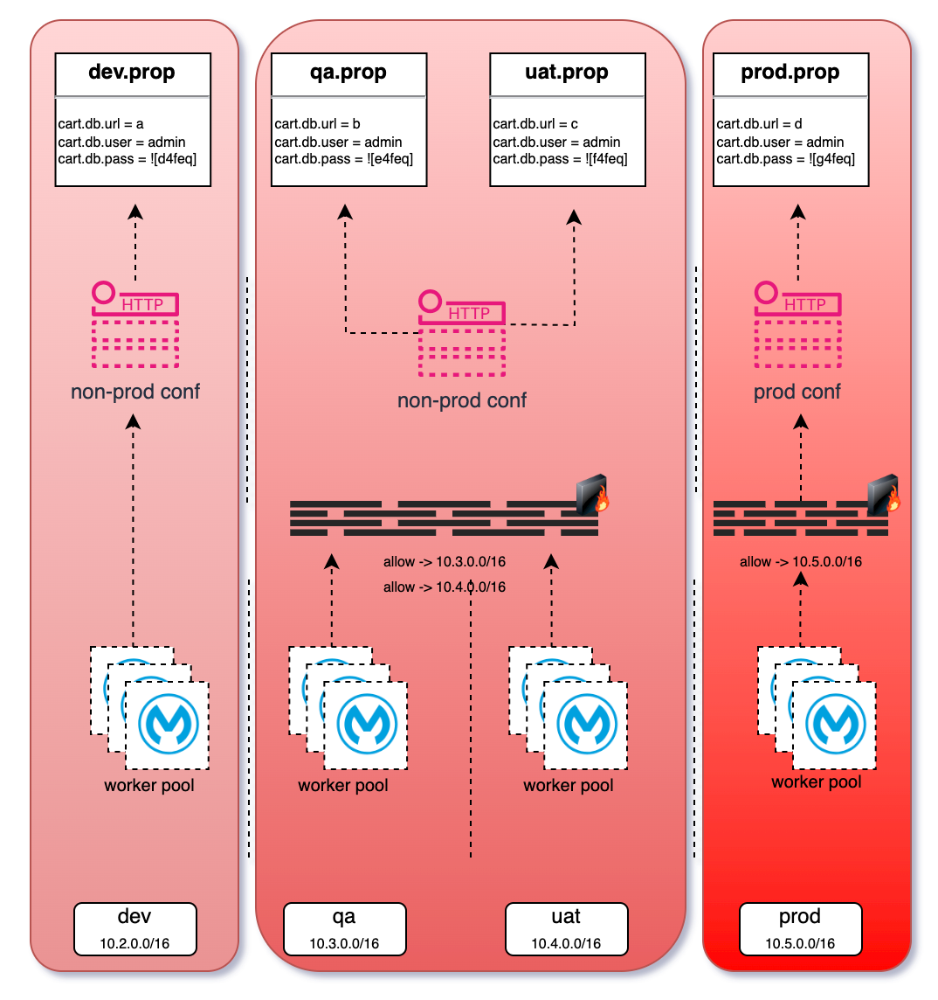
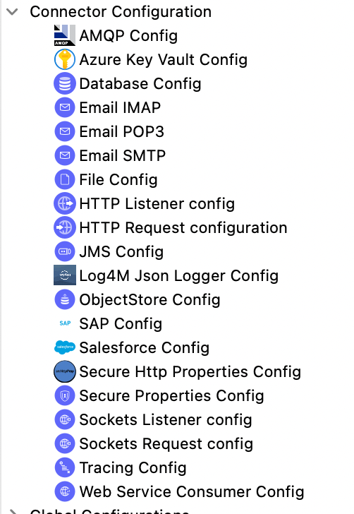
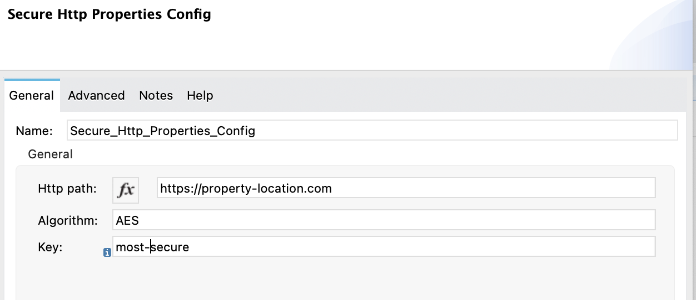

Secure property files from http


Ouf of many alternatives to secure your environment variables, one of the basic approach is - without using a tool  - can be storing your variables in property files. During development this is very fast and convenient. When it comes to production time there are other considerations that you need to consider
 - who can set the variables
 - who can see the variables
 - how to manage different environment variables in relation and coordiantion with each other
 - if a variable needed to be changed in a running env, then which approach would be the fastest and errorness
 - how to seperate variable management and project artifacts management (packages should not contain properties)
 - how to integration variable management with CI/CD
 - how can this be automated
 
One approach would be, without considering vault tools due to some reasons, putting those in one central place and serving thru this place. To secure  these confidential artifacts, from network level, acl would help.

As can be seen, properties can  only be red only respective environment. 



To protect the values itself, we need to encrypt those to prevent seeing from unauthorized eyes. In some cases, nonprod password, mostly dev can be very easy to speed up the development but abviously prod is not. 

dev.properties file
```
billing.db.url=jdbc://devdb
billing.db.user=integration_user
billing.db.pass=devPass123
```

prod.properties file
```
billing.db.url=jdbc://proddb
billing.db.user=integration_user
billing.db.pass=![encrypted-prod-passw]
```

in order to use this connector:

## compile

```sh
mvn clean package -DskipTests
```

## use

Add this dependency to your application pom.xml

```xml
<dependency>
	<groupId>github.com.farukonder.mule4.connectors</groupId>
	<artifactId>secure-http-properties-connector</artifactId>
	<version>0.0.10</version>
	<classifier>mule-plugin</classifier>
</dependency>
```

## setup

mule projects mostly has a confix.xml for just configuration  but in any mule.xml adding connctor conf is enough


with a small set of definitioans


## advanced setup

like location, key and algorithm also can be pull from CI/CD. in order to managed this below  can be the possible approach.


```xml
	<global-property doc:name="Global Property" doc:id="69c8c29a-21fc-409e-a104-635334980abb" 
		name="env" value="qa" />
	<global-property doc:name="Global Property" doc:id="ad915c98-1fca-4d46-86dc-06c19da8b3d9" 
		name="propertyUrl" value="https://get.my.property.local" />
	<global-property doc:name="Global Property" doc:id="550ec493-6ce6-4141-a012-cb80b81b81s4" 
		name="key" value="super-secret" />
	<global-property doc:name="Global Property" doc:id="5v0ec493-6ce6-4141-a012-zb8fb81b8143" 
		name="algorithm" value="Blowfish" />
	<secure-http-properties:config doc:name="Http Properties Config" doc:id="0720a68d-e738-461e-a1a0-fd4c4ada9c32"
		name="Http_Properties_Config" 
		httpPath="${propertyUrl}" algorithm="${algorithm}" key="${key}">
```

## publish

put below xml snipped in your pom.xml file. and run mvn deploy in order to put this jar to artifact repository

```xml
	<distributionManagement>
		<repository>
			<id>repo-mule</id>
			<url>https://pkgs.dev.azure.com/$organization/$project/_packaging/cci-repo-mule/maven/v1</url>
		</repository>
		<snapshotRepository>
			<id>repo-mule</id>
			<url>https://pkgs.dev.azure.com/$organization/$project/_packaging/cci-repo-mule/maven/v1</url>
		</snapshotRepository>
	</distributionManagement>
```

**know issues**
 - There's no XML files that has a <module> root element, thus is impossible to auto generate a [mule-artifact.json] descriptor file. The file must start with [module-] and end with [.xml], such as [module-foo.xml] 
 - - set JAVA_HOME to your env. in my case export JAVA_HOME=/Library/Java/JavaVirtualMachines/jdk1.8.0_301.jdk/Contents/Home# mule-log4m-connector

**references**
 - https://docs.mulesoft.com/mule-runtime/4.4/custom-configuration-properties-provider
 - https://www.salesforce.com/blog/custom-connector-mule-sdk/
 - https://blogs.mulesoft.com/dev-guides/api-connectors-templates/custom-connector-mule-sdk/
 - https://github.com/amitsethi0843/mule4-url-property-placeholder
 - https://docs.mulesoft.com/mule-runtime/4.2/custom-configuration-properties-provider
 - https://www.linkedin.com/pulse/mule4-loading-properties-file-from-httphttps-url-amit-sethi-1d/